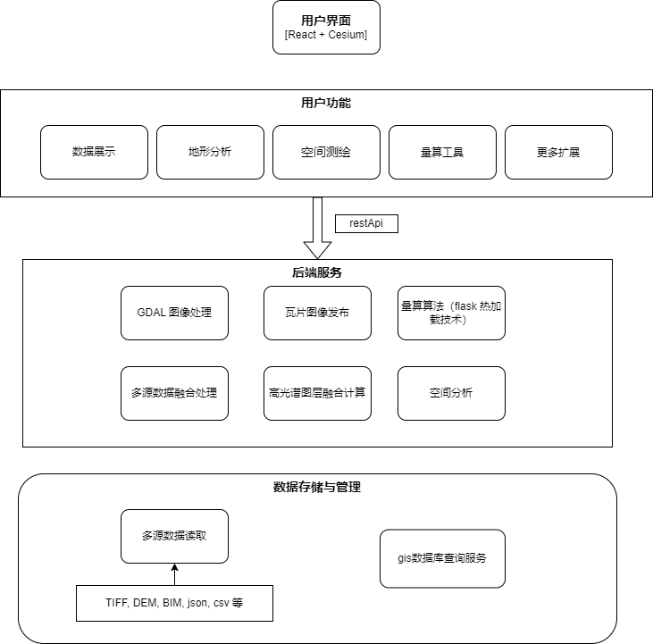

# 一、项目概述

该项目旨在集成和展示多源的战场环境数据，包括目标、建筑模型、地质模型以及高光谱数据等，通过开源平台Cesium进行可视化分析。在融合数据基础上，可支持进行空间距离、地表距离等量算。平台具备高可扩展性，可支撑空间分析功能，包括通视分析、遮蔽分析、地形开挖分析等。平台具有代码编辑器功能，支持用户自定义数据加载方案，分析算法、事件响应等。

# **二、功能描述**

## 1. 数据支持

### 1.1 数据格式支持

| 数据模型  | 数据格式                                                                                                                 |
| ----- | -------------------------------------------------------------------------------------------------------------------- |
| 地形数据  | GeoTIFF (.tif)、DEM (.dem, .asc, .hgt)、Quantized Mesh (.terrain)                                                      |
| 图片数据  | PNG (.png)、JPEG (.jpg)                                                                                               |
| 三维模型  | 3D Tiles (.b3dm, .i3dm, .pnts, .cmpt)、glTF / GLB (.gltf, .glb)、KML / KMZ (.kml, .kmz)、Bentley（.3mx、.3ms）、OSGB（.osgb） |
| 地质模型  | .dng、.dwg                                                                                                            |
| 海洋类数据 | 温、盐、密、浪、潮、流数据                                                                                                        |

### 1.2 数据加载与交互

- 支持多图层加载，用户可自由切换和控制显示的图层，支持图层透明度编辑。
- 支持动态加载和卸载数据，特别是对于大型数据集的按需加载，以提高性能。
- 大型场景或模型使用TMS（Tile Map Service）格式的数据加载，支持自定义瓦片切片级别。
- 支持大规模数据缓存机制，减少重复加载，优化用户体验。
- 支持地形数据夸张展示，提供1-10级夸张级别，方便对地形进行分析判断。

## 2. 分析量算

- **空间距离计算**：提供点与点之间的距离计算功能。
- **地表距离计算**：根据地形高程，计算两个地点之间沿地表的实际距离。
- **地表面积计算**：支持对地表或选择区域的面积计算，并提供单位转换。
- **地形开挖分析**：根据地形数据，展示开挖效果功能。
- **通视遮蔽分析**：能够分析视线是否被地形遮挡，提供视点与目标之间的通视分析功能。
- **自定义开发接口**：支持用户通过代码编辑器，自定义分析量算算法。

## 3. 标记建模

1. **标记工具**
   
   - **点标记**：用户可以在地图上标记单个点。
   - **标记图标**：支持多种标记图标选择，并可根据需求上传自定义图标。
   - **燕尾图标**：支持绘制燕尾形标记、双箭头，用于特殊标注或图示。
   - **画面工具**：支持用户画圆形、矩形、三角形、多边形、半月面、椭等。

2. **建模工具**
   
   - 提供多边形立体建模
   
   - 提供圆柱体立体建模

3. **模型管理**
   
   - 支持模型管理，模型的显示或取消，支持模型透明度编辑。
   - 支持模型的导入与导出，确保可复用性，导出数据格式支持：.shp、.kml、.kmz。

## 4. 场景管理

**4.1 场景保存与导出**

- 提供场景保存功能，保存当前加载的所有图层与实体信息。

- 支持场景导出功能，用户可导出场景为文件，并能在平台中还原，代码编辑器中的代码同样可以导出。

**4.2 场景恢复**

- 支持将导出的场景文件进行导入恢复，能够重建所有加载的图层、实体以及代码。

## 5. 代码编辑

**前端**

使用 **Monaco Editor** 作为前端代码编辑器，提供一个简洁的UI，支持 **语法高亮**、**代码自动补全**、**错误提示**、**格式化**等功能，帮助用户编写和调试JavaScript代码。每当用户执行代码后，编辑器中的代码将通过 **Cesium.Viewer**，态应用到场景中，系统会实时更新 Cesium 场景。这样用户即可通过代码编辑器动态修改场景、加载不同类型的数据（如 3D Tiles、GeoJSON、CZML 等）以及执行空间分析操作。同时，代码编辑器支持事件触发功能，如鼠标单击事件，滚轮事件等，极大的丰富了用户对场景的控制能力。

**后端**

**后端采用Flask进行服务**，提供**Flask API**，用于接收前端请求。发布数据，提供算法等。后端通过热加载技术 ，用户编写python代码并保存后，后端服务将自动更新。

### 6 数据工具

- **TIF 数据转换为 TMS（瓦片数据）**
  
  - 提供将TIF格式地形数据转换为瓦片格式（TMS）的工具。
  - 转换过程中提供分辨率控制和瓦片级别设置。

- **TIF 高程数据转换为瓦片数据**
  
  - 支持将TIF格式高程数据转换为3D模型或高程瓦片数据（如Cesium支持的格式）。
  - 转换后的瓦片支持在平台上无缝加载，支持缩放与平移。

- **倾斜摄影转换为 3D Tiles 数据**
  
  - 提供倾斜摄影数据的转换工具，将其转换为Cesium支持的3D Tiles格式。
  - 支持大规模倾斜摄影数据的处理，保证转换效率与质量。

- **高光谱融合工具**
  
  提供高光谱数据读取融合工具，融合算法包括：加权平均融合算法、PCA(主成分分析)算法。支持用户自定义算法。

- **dem数据生成工具**
  
  提供.dem数据读取生成编辑工具，读取已有的.dem数据，用户通过代码对.dem数据进行编辑，并生成新的dem数据。

- **基础智能工具**
  
  1. 集成pytorch环境、显卡驱动，可以支持cpu、gpu计算。
  2. 提供用户自定义开发智能算法及模型的接口。
  3. 示例：CNN网络进行图像识别。

### 三 系统设计

### 3.1 架构设计

本系统主要分为三个核心层级：用户界面层、后端服务层和数据存储与管理层。每个层级的设计均围绕数据的加载、处理、分析与可视化展开，以满足用户多源数据融合展示功能的需求。

### 3.2 接口设计

在本系统中，接口设计主要包括前后端通信、RESTful API 设计以及前端用户界面与后端服务的交互。接口设计确保了不同组件之间的无缝集成和数据交换。

### 3.****2****.1 前后端接口

前端和后端的主要通信方式为 HTTP RESTful API，使用 JSON 格式传递数据。后端暴露一系列 RESTful 接口，处理用户请求并返回处理结果。API 的设计遵循如下原则：

- 简洁：每个接口功能单一，易于理解。

-  一致性：接口命名、请求方法、参数格式等保持一致。

-  可扩展性：支持新的功能扩展（例如通过自定义脚本）而不破坏现有接口。

### 3.****2****.2 **前端与后端交互**

前端使用 React + Cesium 渲染三维地球及图层，用户可以选择不同的数据图层、执行空间分析、上传数据等。前端通过发起 HTTP 请求，与后端 API 交互，获取数据、分析结果或上传文件。后端使用 Flask 框架处理请求，将请求转发到相应的业务逻辑模块（如GDAL处理、空间分析计算等），并将结果返回给前端。 

### 3.3 系统特点

- 系统前端采用cesium作为可视化库、使用react作为前端框架。使用Ant Design作为UI组件库。
- 系统界面集成Monaco Editor代码编辑器。
- 系统后端使用python语言开发，使用flask作为后端框架，集成pytorch满足用户智能模型自定义的需求。
